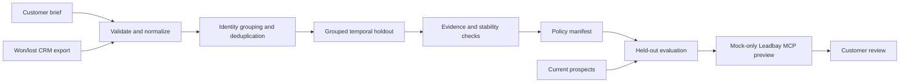

# Leadbay deal-history deployment case

[](https://github.com/ApoorvKadam/leadbay-deal-history-deployment/actions/workflows/ci.yml)

A customer gives you historical won/lost deals and asks what should change in Leadbay.

This repo takes one synthetic building-materials distributor from that export to a reviewable qualification proposal. It tests six customer-written hypotheses, keeps repeat companies on one side of a grouped temporal split, freezes the selected policy before holdout evaluation, and sends the proposed question and anti-pattern calls through the real `@leadbay/mcp@0.40.0` binary in mock mode.

One rule is enforced in code: **historical evidence can support a qualification question; it cannot invent a veto.**

All customer, deal, and prospect data in this repository is synthetic. The checked-in `expected-policy.json` file is a test oracle only. The CLI does not load it or use it to select, gate, or score a policy.

The fixture generator deliberately plants known signal and decoy structure. The synthetic lift is a recovery check for the pipeline, not evidence of customer performance or a claim that the method discovered a real 35-point improvement.

The evidence layer measures customer-supplied CRM or enrichment fields. It does not validate Leadbay's own public-text answers to the resulting questions. A real deployment would qualify held-back historical companies through Leadbay, compare those answers with won/lost outcomes, and review that agreement before changing the account.

## Result

| Measure | Result |
| --- | ---: |
| Historical deals | 80 |
| Training / grouped temporal holdout | 60 / 20 |
| Candidate signals tested | 6 |
| Questions selected | 3 |
| Customer-authored anti-patterns | 1 |
| Holdout policy coverage | 100% |
| Synthetic top-bucket lift | +35.0 percentage points |
| Production writes | 0 |

The selected questions cover fragmented B2B markets, multi-territory field sales, and multi-site operating footprint.

There is one visible limitation in that result. `multi_territory_field_sales` and `multi_site_operations` both carry geographic-reach information. The selector ranks marginal evidence and does not test cross-question redundancy. Those two questions would need a consolidation pass before a customer approval conversation.

Three candidates are rejected and stay visible in the report: enterprise scale points in the wrong direction, recent funding has too much missing data, and warehouse density is too dependent on one repeated-company cluster.

The inactive-company anti-pattern comes directly from the customer brief. A statistical pattern cannot promote itself into a hard exclusion.

These numbers describe one deterministic synthetic case. They are not customer results, revenue claims, or causal evidence. The 5-deal top bucket is intentionally small. With 13 wins among 20 holdout deals, a random 5-deal bucket would contain 5 wins about 8.3% of the time, and +35pp is the maximum possible lift above the 65% baseline.

## Flow



`policy-manifest.json` is the boundary between analysis and deployment. Preview code consumes that frozen manifest; it does not rerun the evidence ranking or add another rule.

## Method choices

### Keep company groups together

A company can have more than one deal. Those deals remain separate observations, but every deal for the same company stays in one partition. The holdout uses the newest company groups, so the test is closer to "what happened later?" than a random row split.

### Keep unknown separate from no

A missing value does not count as a negative answer. Predicates return `true`, `false`, or `unknown`, and coverage is reported alongside the result.

### Check small-data stability

Each candidate is checked for support, missingness, smoothed effect size, and company-cluster bootstrap stability. A signal can be rejected as contradicted, unstable, low support, high missingness, prohibited, or too weak.

### Keep customer vetoes separate

Anti-patterns can only come from the customer brief. If a stated veto would have matched a historical win and that tradeoff has not been acknowledged, the run stops before opening an MCP session. The failure message asks the reviewer to verify whether the status was true at close or only true in the later CRM export.

### Preserve existing Leadbay questions

The synthetic Leadbay account begins with two qualification questions. Leadbay allows five, so this case can add up to three. Version 1 never removes or swaps an existing question automatically.

## Production boundary

There is **no live-apply path** in version 1.

The CLI has no production token option, no production base URL option, and no `--apply` or `--live` flag. Preview uses the real `@leadbay/mcp@0.40.0` stdio process only after these checks pass:

- the child has `LEADBAY_MOCK=1`;
- the base URL is exactly `https://leadbay.invalid`;
- the child environment is allowlisted, so parent cloud credentials, proxy settings, npm tokens, GitHub tokens, `NODE_OPTIONS`, and user profile configuration do not pass through;
- stderr contains the Leadbay mock-mode banner;
- a fixture-backed read returns the expected starting state;
- the expected read and write tool contracts are present;
- no production hostname appears in stderr, results, or trace; and
- no unacknowledged historical-win veto tradeoff exists.

Question additions and anti-pattern additions are previewed as separate calls because Leadbay treats those inputs separately. The final state is labeled `projected` and `persisted: false`.

## Run it

Requirements:

- Node.js 22 or newer
- pnpm 9.15.4

```bash
corepack enable
corepack prepare pnpm@9.15.4 --activate
pnpm install --frozen-lockfile
pnpm check
pnpm demo
```

The package exposes `leadbay-deploy` as its bin name. CI also tests the compiled entry point directly:

```bash
node dist/cli.js validate \
  --case fixtures/building-materials-distributor

node dist/cli.js analyze \
  --case fixtures/building-materials-distributor \
  --out artifacts/analysis

node dist/cli.js preview \
  --case fixtures/building-materials-distributor \
  --manifest artifacts/analysis/policy-manifest.json \
  --out artifacts/preview

node dist/cli.js demo \
  --case fixtures/building-materials-distributor \
  --out artifacts/building-materials-distributor
```

A complete demo writes 16 top-level entries atomically. Start with:

- `data-quality.md`: what was cleaned, rejected, or treated as unknown
- `signal-evidence.json`: every candidate and why it passed or failed
- `policy-manifest.json`: the frozen policy selected from training data
- `holdout-evaluation.json`: what happened on later held-out deals
- `prospect-preview.csv`: how the same policy ranks current prospects
- `leadbay-mcp-trace.json`: the read and mock write sequence
- `leadbay-deployment-preview.json`: accepted tool inputs and locally projected state
- `deployment-report.md`: the customer-facing review packet

The committed example is in [`docs/examples/building-materials-distributor`](docs/examples/building-materials-distributor).

## Proof

The repository is verified against the real Leadbay package, not only a fake MCP session.

CI installs the frozen dependency graph and checks:

- `@leadbay/mcp@0.40.0`
- `@modelcontextprotocol/sdk@1.29.0`
- Node.js 22
- an audit of production dependencies that reports every advisory and fails on high or critical findings
- Biome lint
- strict TypeScript
- 35 test files
- the compiled CLI contract
- deterministic fixture generation
- the compiled CLI against the real Leadbay MCP process in mock mode
- a 90-day GitHub Actions artifact containing the full real-run demo package, including the MCP trace, attestation, deployment preview, and summary
- a clean tracked tree after the demo

This repository was checked against Leadbay's public `mcp-v0.40.0` source. The qualification tools still use a five-question ceiling, require confirmation when an existing question is dropped, and return the buyer profile plus targeting prompt on the read.

See [`docs/verification.md`](docs/verification.md) for the exact gates and what they prove.

## Project map

- [`docs/architecture.md`](docs/architecture.md): module boundaries and data flow
- [`docs/deployment-case.md`](docs/deployment-case.md): how the synthetic case was constructed and what it is meant to test
- [`docs/demo-script.md`](docs/demo-script.md): a three-minute reviewer walkthrough
- [`docs/examples/building-materials-distributor`](docs/examples/building-materials-distributor): the curated output package
- [`docs/verification.md`](docs/verification.md): CI, package, and safety verification

## Not done here

- No production Leadbay write.
- No claim that the synthetic lift transfers to a real customer.
- No proof that CRM labels and Leadbay's public-text answers agree until held-back companies are run through Leadbay.
- No redundancy-aware question selection. The two geographic-reach questions are called out above and in the generated report.

This is a standalone demo built against Leadbay's public MCP package. It is not an official Leadbay product.
