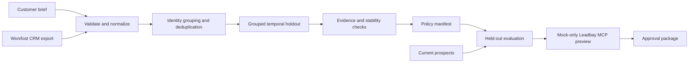

# Leadbay Deal-History Deployment Kit

[](https://github.com/ApoorvKadam/leadbay-deal-history-deployment/actions/workflows/ci.yml)


A customer hands you a messy export of historical won/lost deals. Which patterns are useful enough to turn into qualification questions, which ones are noise, and which rules must stay a human decision?

This repo works through that problem end to end for a synthetic building materials distributor. It cleans the CRM history, keeps repeat companies out of both sides of the train and holdout split, tests customer supplied hypotheses, evaluates the frozen policy on later deals, and previews the exact Leadbay settings that would change.

I built it around one rule: **historical correlation can suggest a question, but it cannot invent a veto.**

All customer, deal, and prospect data in this repository is synthetic data.

## What comes out of the case

| Measure | Result |
| --- | ---: |
| Historical deals | 80 |
| Training / grouped temporal holdout | 60 / 20 |
| Candidate signals tested | 6 |
| Questions selected | 3 |
| Customer authored anti-patterns | 1 |
| Holdout policy coverage | 100% |
| Synthetic top bucket lift | +35.0 percentage points |
| Production writes | 0 |

The three selected questions cover fragmented B2B markets, multi-territory field sales, and CRM or ERP exportability.

The case also contains useful rejections. Enterprise scale points in the wrong direction, recent funding has too much missing data, and warehouse density is too dependent on one repeated-company cluster. Those rejected hypotheses stay in the report instead of disappearing.

The anti-pattern for inactive, dissolved, or liquidated companies comes directly from the customer brief. The analyzer is not allowed to promote a statistical pattern into a hard exclusion.

These numbers describe one deterministic synthetic case. They are not customer results, revenue claims, or causal evidence.

## The flow



The analysis and deployment layers meet at `policy-manifest.json`. That file is the handoff. The deployment code cannot reinterpret the analysis or quietly add another rule.

## Why the evaluation is set up this way

### Company groups stay together

A company can have more than one deal. Those deals remain separate observations, but every deal for the same company stays in one partition. The holdout is made from the newest company groups, so the test is closer to "what happened later?" than a random row split.

### Missing means unknown

A missing value does not count as a negative answer. Predicates return `true`, `false`, or `unknown`, and coverage is reported alongside the result.

### Small data gets a stability check

Each candidate is checked for support, missingness, smoothed effect size, and company-cluster bootstrap stability. A signal can be rejected as contradicted, unstable, low support, high missingness, prohibited, or too weak.

### Customer vetoes stay separate

Anti-patterns can only come from the customer brief. If a stated veto would have excluded a historical win and that tradeoff has not been acknowledged, the run stops before opening an MCP session.

### Existing Leadbay questions are preserved

The synthetic Leadbay account begins with two qualification questions. Leadbay allows five, so this case can add up to three. Version 1 never removes or swaps an existing question automatically.

## Mock-only Leadbay boundary

There is **no live-apply path** in version 1.

The CLI has no production token option, no production base URL option, and no `--apply` or `--live` flag. The preview uses the real `@leadbay/mcp@0.39.10` stdio process, but only after the following checks:

- the child has `LEADBAY_MOCK=1`;
- the base URL is exactly `https://leadbay.invalid`;
- the child environment is allowlisted, so parent cloud credentials, proxy settings, npm tokens, GitHub tokens, `NODE_OPTIONS`, and user profile configuration do not pass through;
- stderr contains the Leadbay mock-mode banner;
- a fixture-backed read returns the expected starting state;
- the expected read and write tool contracts are present;
- no production hostname appears in stderr, results, or trace; and
- no unacknowledged historical-win veto tradeoff exists.

Question additions and anti-pattern additions are previewed as separate calls because Leadbay treats those inputs separately. The final state is labeled `projected` and `persisted: false`.

## Run it

Requirements:

- Node.js 22 or newer
- pnpm 9.15.4

```bash
corepack enable
corepack prepare pnpm@9.15.4 --activate
pnpm install --frozen-lockfile
pnpm check
pnpm demo
```

The CLI has four workflows:

```bash
leadbay-deploy validate \
  --case fixtures/building-materials-distributor

leadbay-deploy analyze \
  --case fixtures/building-materials-distributor \
  --out artifacts/analysis

leadbay-deploy preview \
  --case fixtures/building-materials-distributor \
  --manifest artifacts/analysis/policy-manifest.json \
  --out artifacts/preview

leadbay-deploy demo \
  --case fixtures/building-materials-distributor \
  --out artifacts/building-materials-distributor
```

A complete demo writes 16 top-level entries atomically. The most useful ones to inspect first are:

- `data-quality.md`: what was cleaned, rejected, or treated as unknown
- `signal-evidence.json`: every candidate and why it passed or failed
- `policy-manifest.json`: the frozen policy selected from training data
- `holdout-evaluation.json`: what happened on later held-out deals
- `prospect-preview.csv`: how the same policy ranks current prospects
- `leadbay-mcp-trace.json`: the read and mock write sequence
- `leadbay-deployment-preview.json`: exact accepted tool inputs and projected state
- `deployment-report.md`: the customer-facing review packet

The committed example is in [`docs/examples/building-materials-distributor`](docs/examples/building-materials-distributor).

## Verification

The release candidate is verified against the real Leadbay package, not only a fake MCP session.

CI installs the frozen dependency graph and checks:

- `@leadbay/mcp@0.39.10`
- `@modelcontextprotocol/sdk@1.29.0`
- Node.js 22
- Biome lint
- strict TypeScript
- **35 test files and 131 passing tests**
- deterministic fixture generation
- the real Leadbay MCP process in mock mode
- a clean tracked tree after the demo

The current Leadbay public source still reports package version `0.39.10`, keeps the five-question ceiling, requires confirmation for removals, and returns the buyer profile plus targeting prompt with the qualification-question read.

See [`docs/verification.md`](docs/verification.md) for the exact gates and what they prove.

## Project map

- [`docs/architecture.md`](docs/architecture.md): module boundaries and data flow
- [`docs/deployment-case.md`](docs/deployment-case.md): how the synthetic case was constructed and what it is meant to test
- [`docs/demo-script.md`](docs/demo-script.md): a three-minute reviewer walkthrough
- [`docs/examples/building-materials-distributor`](docs/examples/building-materials-distributor): the curated output package
- [`docs/verification.md`](docs/verification.md): CI, package, and safety verification

## Scope

This is an independent deployment demonstration built against Leadbay's public MCP package. It is not an official Leadbay product.

The project stops at a projected configuration that a customer can inspect. A real account change would be a separate, human-approved action through Leadbay's own product or another reviewed deployment workflow.
